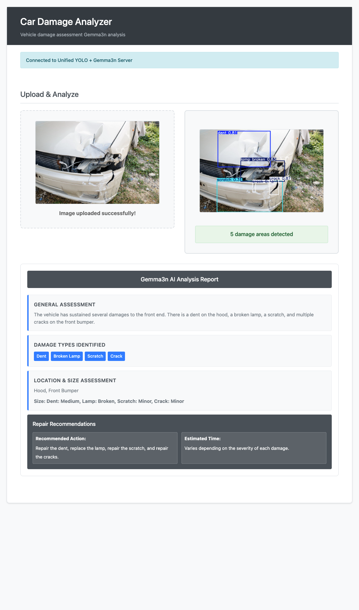
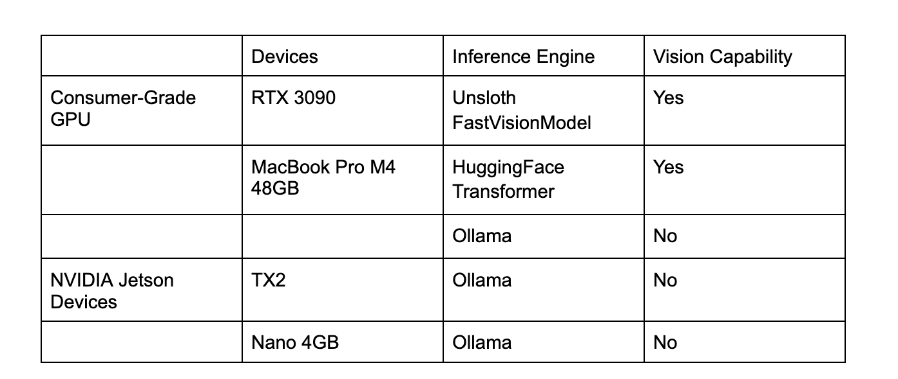

# AutoVision Inspector

Dataset:
- Website - [Link](https://cardd-ustc.github.io/)
- Paper - [Link](https://cardd-ustc.github.io/docs/CarDD.pdf)
- Dataset - [Link](https://drive.google.com/file/d/1bbyqVCKZX5Ur5Zg-uKj0jD0maWAVeOLx/view)
- Our Annotated Dataset - [Link](https://huggingface.co/datasets/gigwegbe/damaged-car-dataset-annotated)

Model: 
- Finetune Adapter - [Link](https://huggingface.co/gigwegbe/gemma-3n-E2B-it-finetuned-adapters)
- Merge Model(Based Model and Finetunned Adapter) - [Link](https://huggingface.co/gigwegbe/gemma3n-merged)
- GGUF Models - [Link](https://huggingface.co/gigwegbe/gemma3n-gguf)
- Training Logs (wandb) - [Link](https://wandb.ai/gigwegbe-carnegie-mellon-university/my-vision-finetune?nw=nwusergigwegbe)
  

## Process Flow 
- Train using Damaged Car Dataset  
- Push the merge model to hub 
- Convert the merged model to gguf (Might have to create a swap memory)
- Convert to different format(bf16,f16,q2_k,q4_k_m,q8 etc.)
- Run on Ollama, Huggingface Engine and UnSloth FastVisionModel Engine

## Deployment Summary

## How to run the Application
Start the AutoVision Inspector VLM
- Launch VLM Deployment - [Link](https://github.com/gigwegbe/gemma3n-car-damage-competition/tree/main/hugginface_deployment)

Start the WebSocket Server and Frontend
- Start WebSocket & Serve Frontend - [Link](https://github.com/gigwegbe/gemma3n-car-damage-competition/tree/main/object_detection)

## TODO 
- Add wandb log - Done 
- While merging, monitor GPU memory usage with (watch -n 1 nvidia-smi) - Done 
- Save image locally - Done( Kindly review)
  - Test the system with new JSON format - Done 
  - Review prompt("Only include entries that are visible in the image.") - Done 
- Inference Script - Done 
- Add frontend material - Done 
- Add Backend material - Done 
- Add Report - Done 
- Upload Video - Done 
- Remove all token or make them invalid - Done 
- Add Notebook to Kaggle
- Add paper - Done 
- Add Design - GoodNote - Done 
- Add Wandb 
  - Link - Done
  - Images - Done 
- Update Huggingface readme 
- Add Readme of the following:
  - training - Done 
  - inference - Done 
  - deployment - Done 
  - notebooks - Done 
  - Ollama deployment - ?
  - Inference reference - ?
  - local huggingface deployment
      - review the `max_new_tokens` currently 40 change to smt - Done 
      - review the attention head ? 8 - Done 
      - Macbook M4 - Done 
      - RTX 3090 - Done 
      - Add requirements for deployment - Done 

- Review all links are working 
  

  # References
  - [Running Ollama 2 on NVIDIA Jetson Nano with GPU using Docker](https://collabnix.com/running-ollama-2-on-nvidia-jetson-nano-with-gpu-using-docker/)
-  [Failed at model.save_pretrained_gguf](https://github.com/unslothai/unsloth/issues/341#issuecomment-2340006070)
-  [Docker Setup for Unsloth](https://github.com/unslothai/unsloth/wiki#1-dockerfile)
-  [Fine Tune StarCoder2-3B](https://debuggercafe.com/fine-tune-starcoder2-3b/)
-  [Adding Models to Ollama](https://debuggercafe.com/adding-models-to-ollama/)
-  [Importing a model from Safetensors weights into Ollama](https://debuggercafe.com/adding-models-to-ollama/)
-  [Importing a GGUF based model or adapter](https://github.com/ollama/ollama/blob/main/docs/import.md#importing-a-gguf-based-model-or-adapter)
-  [Quantizing a Model](https://github.com/ollama/ollama/blob/main/docs/import.md#quantizing-a-model)
