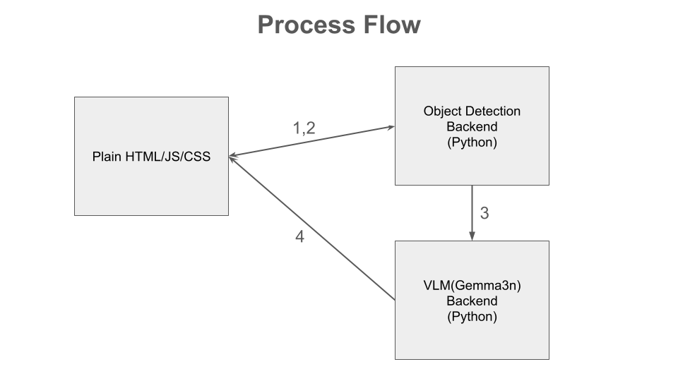

# AutoVisionInspector - Gemma3n Impact Challenge
Demo: [Video 1](https://www.youtube.com/watch?v=2nr59kP-Ano) [Video 2](https://www.youtube.com/watch?v=lZjY6w1PU30)

### With Vision Capabilities

### Using Text Capabilities Only With Ollama

Dataset:
- Website - [Link](https://cardd-ustc.github.io/)
- Paper - [Link](https://cardd-ustc.github.io/docs/CarDD.pdf)
- Dataset - [Link](https://drive.google.com/file/d/1bbyqVCKZX5Ur5Zg-uKj0jD0maWAVeOLx/view)
- Our Annotated Dataset - [Link](https://huggingface.co/datasets/gigwegbe/damaged-car-dataset-annotated)

Model: 
- Finetune Adapter - [Link](https://huggingface.co/gigwegbe/gemma-3n-E2B-it-finetuned-adapters)
- Merge Model(Based Model and Finetunned Adapter) - [Link](https://huggingface.co/gigwegbe/gemma3n-merged)
- GGUF Models - [Link](https://huggingface.co/gigwegbe/gemma3n-gguf)
- Training Logs (wandb) - [Link](https://wandb.ai/gigwegbe-carnegie-mellon-university/my-vision-finetune?nw=nwusergigwegbe)
  

## Project Flow 
- Train using Damaged Car Dataset  
- Push the merge model to hub 
- Convert the merged model to gguf (Might have to create a swap memory)
- Convert to different format(bf16,f16,q2_k,q4_k_m,q8 etc.)
- Run on Ollama, Huggingface Engine and UnSloth FastVisionModel Engine

## Process Flow 

We built the frontend using plain HTML, JavaScript, and CSS, enabling users to upload an image and interact with the backend systems.
- 1: The uploaded image is first sent to the Object Detection Backend (Python), which processes the image and generates annotations (e.g., bounding boxes, detected parts).
- 2: These annotated results are then passed to the VLM (Gemma3n) Backend, which performs deeper visual-language analysis.
- 3: The final analysis output from the VLM is returned to the frontend for display.
  
This modular flow allows for clear separation between object detection and vision-language reasoning, while keeping the frontend lightweight and efficient.

## Deployment Summary

### Edge Devices - Jetson TX2 and Jetson Nano 

## How to run the Application
Start the AutoVision Inspector VLM
- Launch VLM Deployment - [Link](https://github.com/gigwegbe/gemma3n-car-damage-competition/tree/main/hugginface_deployment)

Start the WebSocket Server and Frontend
- Start WebSocket & Serve Frontend - [Link](https://github.com/gigwegbe/gemma3n-car-damage-competition/tree/main/object_detection)

## References
- [Running Ollama 2 on NVIDIA Jetson Nano with GPU using Docker](https://collabnix.com/running-ollama-2-on-nvidia-jetson-nano-with-gpu-using-docker/)
-  [Failed at model.save_pretrained_gguf](https://github.com/unslothai/unsloth/issues/341#issuecomment-2340006070)
-  [Docker Setup for Unsloth](https://github.com/unslothai/unsloth/wiki#1-dockerfile)
-  [Fine Tune StarCoder2-3B](https://debuggercafe.com/fine-tune-starcoder2-3b/)
-  [Adding Models to Ollama](https://debuggercafe.com/adding-models-to-ollama/)
-  [Importing a model from Safetensors weights into Ollama](https://debuggercafe.com/adding-models-to-ollama/)
-  [Importing a GGUF based model or adapter](https://github.com/ollama/ollama/blob/main/docs/import.md#importing-a-gguf-based-model-or-adapter)
-  [Quantizing a Model](https://github.com/ollama/ollama/blob/main/docs/import.md#quantizing-a-model)
