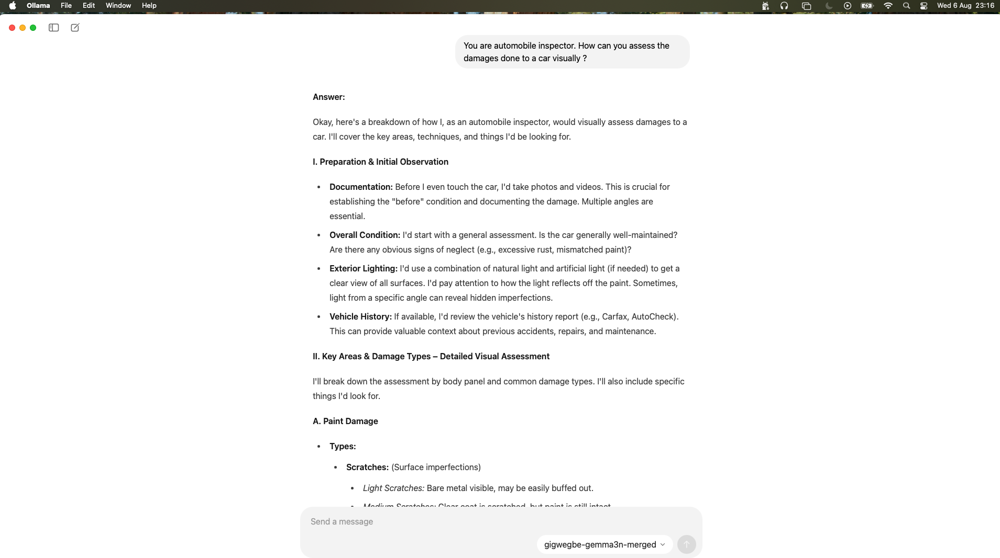

There are different way to deploy to Ollama: 
We tried 2 methods: 

- Using SafeTensor model from Huggingface
- Pulling Model from Huggingface
- Using GGUF model  converted using Llamacpp: 
    To building llamacpp: 
    ```
    ./build_gguf_llamacpp.sh
    ```
    After that run the command below to convert the model: 
    ```
    python llama.cpp/convert_hf_to_gguf.py gemma-use/ --outfile gguf --outtype f16
    ```

    To build the gguf model with the vision projection adapter
    ```
    python llama.cpp/convert_hf_to_gguf.py gemma-use/ --outfile gguf --outtype f16 --mmproj . 
    ```


Quantization of Models: 
We converted the model to various formats to support  various low powered devices: 
<Add Image>

Link to the  Models(GGUF) repository - [Link](https://huggingface.co/gigwegbe/gemma3n-merged)
   

Deployment on different device: 

- Macbook M4: 
    


- Jetson TX2 
   


- Jetson Nano 4GB
   

### References
-  [Adding Models to Ollama](https://debuggercafe.com/adding-models-to-ollama/)
-  [Importing a model from Safetensors weights into Ollama](https://debuggercafe.com/adding-models-to-ollama/)
-  [Importing a GGUF based model or adapter](https://github.com/ollama/ollama/blob/main/docs/import.md#importing-a-gguf-based-model-or-adapter)